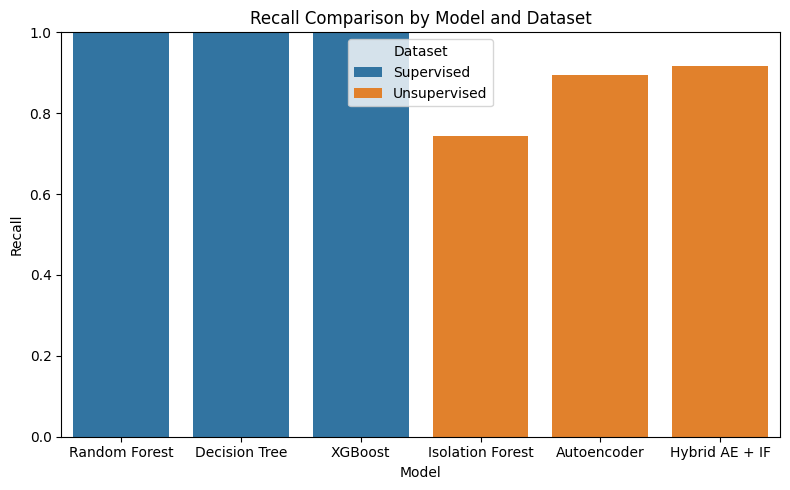
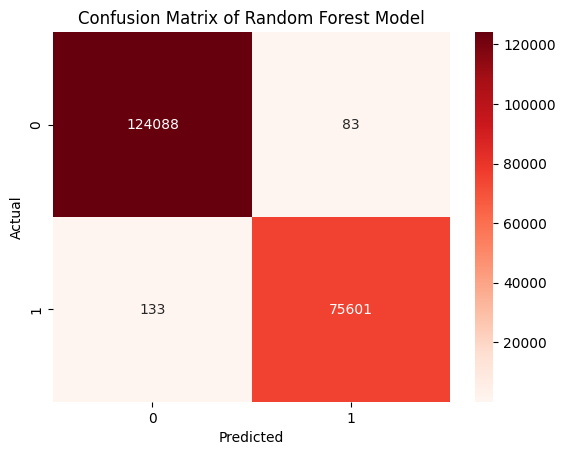

# Network Traffic Anomaly Detection with Machine Learning

This project implements and compares various Machine Learning models (supervised, unsupervised, and hybrid) for network anomaly detection. It uses the CICIDS 2017 dataset and provides an interactive Streamlit dashboard for visualization and analysis of the results.

---

## Objectives

- Load and preprocess a realistic network traffic dataset
- Perform exploratory data analysis (EDA) to understand key features and attack patterns
- Train, test and evaluate various machine learning models for anomaly detection:
  - Supervised: Random Forest, Decision Trees, XGBoost
  - Unsupervised: Isolation Forest
  - Hybrid: Combination of Autoencoder + Isolation Forest
- Evaluate model performance using:
  - Confusion Matrix
  - Precision, Recall, F1-Score
  - ROC-AUC Curve
- Build an interactive dashboard using Streamlit.

---

## Dataset

We use the [CICIDS 2017 dataset](https://www.unb.ca/cic/datasets/ids-2017.html), which contains realistic traffic including both normal behavior and multiple types of attacks:

File                                                        Attack Type
- `Tuesday-WorkingHours.pcap_ISCX.csv`                      - Brute Force (FTP, SSH)
- `Wednesday-workingHours.pcap_ISCX.csv`                    - DoS (Slowloris, Hulk, etc)
- `Friday-WorkingHours-Afternoon-PortScan.pcap_ISCX.csv`    - Port Scan
- `Friday-WorkingHours-Afternoon-DDos.pcap_ISCX.csv`        - DDoS
- `Thursday-WorkingHours-Morning-WebAttacks.pcap_ISCX.csv`  - Web Attack (XSS, SQL Injection)
- `Friday-WorkingHours-Morning.pcap_ISCX.csv`               - DoS (LOIC, HOIC)

---

## Tech Stack

- **Language:** Python 3.10+
- **Libraries:**
  - `pandas`, `numpy` – data manipulation
  - `scikit-learn`, `imbalanced-learn` – ML models and preprocessing
  - `matplotlib`, `seaborn` – data visualization
  - `streamlit` – dashboard (optional)
- **Notebook environment:** Jupyter

---

## Project Structure

network-anomaly-detection/
  - README.md
  - requirements.txt
  - data/
  - images
  - models/
    - pca/
    - scalers/
  - notebooks/
    - 01_exploration.ipynb
    - 2.1_model_training.ipynb  -> Supervised training
    - 2.2 model_training.upynb  -> Unsupervised training
    - 03_model_evaluating.ipynb
    - 04_model_testing.ipynb
  - src/
    - preprocess.py
    - train_model.py
    - utils.py
    - utils_evaluate.py

---

## Loading the Data and Feature Selection

Due to the large size of the original CICIDS 2017 dataset files, each containing hundreds of thousands or millions of rows, we preformed a downsampling step to make the data manageable for processing and model training. Specifically, We randomly selected **50000 rows** from each file (corresponding to different days and attack types).

Random sampling was used instead of just taking the first 50000 rows to avoid a highly unbalanced datased. This ensured a more balanced and representative subset of normal and attack traffic for each file.

### Features Removed:
  - Network identifiers: `Flow ID`, `Source IP`, `Source Port`, `Destination IP`, `Destination Port`, `Timestamp`, `Label`
  - Low-value features: `Fwd Header Length.1`, `Fwd Avg Bytes/Bulk`, `Bwd Avg Packets/Bulk`, etc.

### Important Features Kept:
  Feature                       Meaning
  - `Fwd Packet Length Mean`    - Avg size of outgoing packets - strong indicator
  - `Flow Duration`             - Time duration of flow - attacks often extreme
  - `Total Fwd Packets`         - High in DoS
  - `Bwd Packet Length Max`     - Anomalous replies often show extremes

---

## Model Training

Binary classification: **Normal vs Attack**

### Imbalanced dataset

Imbalanced dataset (more normal traffic(0) than attack traffic(1)).
If we don't address this, models may become biased toward predicting the majority class.

**Handling Class Imbalance:**
- We will use metrics like Recall, Precision, F1-score and AUC instead of just accuracy. 
- We will use techniques like class_weight='balanced'.

### Supervised Model Training

We implemented supervised classification methods that learn to distinguish normal from attack traffic **based on labeled data**:
- **Random Forest:** An ensemble method that builds multiple decision trees and combines their outputs.
- **Decision Tree:** A model that splits the data into branches based on feature thresholds.
- **XGBoost:** A gradient boosting algorithm that sequentially builds trees to correct errors from previous models.

### Unsupervised Anomaly Detection

We implemented anomaly detection methods that **do not rely on attack labels**:
- **Isolation Forest:** Tree-based method that isolates anomalies
- **Autoencoder:** Neural network trained to reconstruct normal traffic patterns
- **Hybrid AE + IF:** Combines AE reconstruction error with Isolation Forest anomaly score

### Metrics Tracked

- **Precision / Recall / F1-Score** – to handle class imbalance
- **Confusion Matrix** – especially false negatives (missed attacks)
- **ROC-AUC** – overall model performance

---

## Model Testing 
To evaluate generalization, models were tested on **new files with previous unseen attack types**, such as Web attacks(SQL Injection, XSS).

The evaluation considers two distinct scenarios:
1. **Known Attacks** - test data containing attack types also used during training (familiar patterns).
2. **Unknown Attacks** - test data containing attack types **not seen** during training (unfamiliar patterns).

This distinction is crucial in cybersecurity, as real-world systems must handle not only known threats but also unseen attacks.

### Supervised Models
|Model            |Dataset   |Accuracy   |Precicion  |Recall     |F1-Score   |ROC-AUC
|-----------------|----------|-----------|-----------|-----------|-----------|-------
| Random Forest   |Known     | 1.0000    | 0.9990    | 0.9989    | 0.9989    | 1.00
| Random Forest   |Unknown   | 0.9900    | 0.5110    | 0.5009    | 0.4993    | 0.97
| Decision Tree   |Known     | 1.0000    | 0.9987    | 0.9988    | 0.9988    | 1.00
| Decision Tree   |Unknown   | 0.9900    | 0.5640    | 0.5071    | 0.5104    | 0.51
| XGBoost         |Known     | 1.0000    | 0.9995    | 0.9996    | 0.9995    | 1.00
| XGBoost         |Unknown   | 0.9900    | 0.9563    | 0.7783    | 0.8452    | 0.99

### Unsupervised Models
|Model              |Dataset   |Accuracy  |Precicion  |Recall     |F1-Score   |ROC-AUC
|-------------------|----------|----------|-----------|-----------|-----------|-------
| Isolation Forest  |Known     | 0.67     | 0.5438    | 0.7442    | 0.6284    | 0.79
| Isolation Forest  |Unknown   | 0.67     | 0.0351    | 0.9195    | 0.0676    | 0.70
| Autoencoder       |Known     | 0.75     | 0.6139    | 0.8950    | 0.7283    | 0.85
| Autoencoder       |Unknown   | 0.86     | 0.0744    | 0.8823    | 0.1373    | 0.82
| Hybrid AE + IF    |Known     | 0.71     | 0.5721    | 0.9167    | 0.7045    | ----
| Hybrid AE + IF    |Unknown   | 0.86     | 0.0771    | 0.9048    | 0.1422    | ----

**Figure 1:** Recall comparison for known attacks across models. 

**Figure 2:** Recall comparison for unknown attacks across models. 

**Figure 3:** Confusion matrix for Random Forest on known attacks.  

**Figure 4:** Confusion matrix for Random Forest on unknown attacks.  

**Figure 3:** Confusion matrix for XGBoost on unknown attacks.  

**Figure 5:** Confusion matrix for Hybrid AE + IF on unknown attacks.  

---

## Analysis
1. **Supervised models** 
- Achieved near-perfect performance on known attacks (accuracy >99%), confirming their ability to learn familiar patterns extremely well.
- **Overfitting issue:** On unseen attack types, Random Forest and Decision Tree recall for the attack class dropped drastically (~0.3%).
- **XGBoost** demonstrated better generalization, having relatively high recall (~72%) on unknown attacks.

2. **Unsupervised models** 
- Generally achieved much higher recall (comparing to the supervised models), indicating better adaptability to threats, but at the cost of precision (more false positives).
- **Hybrid AE+IF** provided a balance, with recall above 0.90 for unseen attacks, making it suitable as part of a unfamiliar detection strategy.

3. **Conclusions**
- **Supervised learning** is optimal for detecting **known, well-characterized attacks** where labeled data is available.  
- **Unsupervised anomaly detection** is crucial for identifying **zero-day attacks**.  
- The most effective detection pipeline for real-world use is **hybrid** — leveraging supervised models for precision on known threats, and unsupervised models for high recall on new threats.  

**Figure 6:** ROC curve for Decision Tree showing model performance on on unknown attacks.  

**Figure 7:** ROC curve for XGBoost showing model performance on on unknown attacks.  

**Figure 8:** ROC curve for Isolation Forest showing model performance on on known attacks.  

**Figure 9:** ROC curve for Isolation Forest showing model performance on on unknown attacks.  

---

## Installation

git clone https://github.com/sofiapereirag/network-anomaly-detection.git
cd network-anomaly-detection
pip install -r requirements.txt

---

## How to run

1. Download the dataset from CICIDS 2017 and place it in the /data folder.
2. Run the notebook:
  jupyter notebook nothebooks/01_exploration.ipynb

---

## Interactive Dashboard

This project includes a **Streamlit** dashboard to visually explore the model results.

### How to run:

pip install -r requirements.txt
streamlit run app.py

## Future Improvements
 - Hyperparameter tuning with GridSearchCV
 - SHAP for model explainability 
 - Live packet capture with Scapy 

---

## Author

- Sofia Miranda Pereira Gonçalves
- MSc Electrical and Computer Engineering, Técnico Lisboa
- Interested in Machine Learning, Data Science & Network Systems 

---

## Resources
- Dataset: [CICIDS 2017](https://www.unb.ca/cic/datasets/ids-2017.html)

---

## Ethics and Privacy
This project uses publicly available network traffic data (CICIDS 2017) for research and educational purposes. The dataset contains no personally identifiable information. Intrusion detection techniques should be applied responsibly and in compliance with relevant privacy and cybersecurity regulations.

